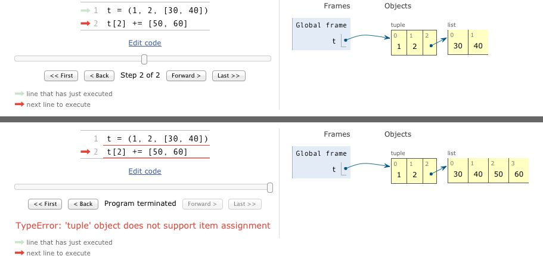

## 内置数据类型速览
Python 标准库用 C 实现了丰富的序列类型，列举如下。
容器序列：list 、tuple 和 collections.deque 这些序列能存放不同类型的数据。
扁平序列：str 、bytes 、bytearray 、memoryview 和 array.array ，这类序列只能容纳一种类型。

## 列表推导和生成器表达式
+ 列表推导
列表推导是构建列表（list ）的快捷方式，而生成器表达式则可以用来创建其他任何类型的序列。
```
 dummy = [x for x in 'ABC']
 [ord(s) for s in symbols if ord(s) > 127]
 [(x,y) for x in a for y in b]
```


注意：Python 2.x 中，在列表推导中 for 关键词之后的赋值操作可能会影响列表推导上下文中的同名变量。像下面这个 Python 2.7 控制台对话，此时x='c'
```
 x = 'my precious'
 dummy = [x for x in 'ABC']
```
在 Python 3 中都有了自己的局部作用域，就像函数似的。表达式内部的变量和赋值只在局部起作用，表达式的上下文里的同名变量还可以被正常引用，局部变量并不会影响到它们。

+ 生成器表达式【节省内存】

虽然也可以用列表推导来初始化元组、数组或其他序列类型，但是生成器表达式是更好的选择。这是因为生成器表达式背后遵守了迭代器协议，可以逐个地产出元素，而不是先建立一个完整的列表，然后再把这个列表传递到某个构造函数里。前面那种方式显然能够节省内存。

```
  (x for x in a)
```


## 元组不仅仅是不可变的列表

除了用作不可变的列表，它还可以用于没有字段名的记录。【tuple 不支持对它的元素赋值】

+ 元组拆包：元祖拆包可以应用到任何可迭代对象上，唯一的硬性要求是，被可迭代对象中的元素数量必须要跟接受这些元素的元组的空档数一致。在进行拆包的时候，我们不总是对元组里所有的数据都感兴趣，_ 占位符能帮助处理这种情况。

```
  h=(110,200,300)
  a,b,c= h
```

使用来处理剩下的元素，在 Python 中，函数用 *args 来获取不确定数量的参数算是一种经典写法了

+ 嵌套元组拆包

```
info = (222,(3,5))
c,(x,y) =info
print(x,y)
```

+ 命名元祖

1. 创建一个具名元组需要两个参数，一个是类名，另一个是类的各个字段的名字。后者可以是由数个字符串组成的可迭代对象，或者是由空格分隔开的字段名组成的字符串
2. 存放在对应字段里的数据要以一串参数的形式传入到构造函数中（注意，元组的构造函数却只接受单一的可迭代对象）
3. 通过字段名或者位置来获取一个字段的信息


## 切片

在 Python 里，像列表（list ）、元组（tuple ）和字符串（str ）这类序列类型都支持切片操作

```
l = [10, 20, 30, 40, 50, 60]
l[:2] # 在下标2的地方分割
[10, 20]
```

一个众所周知的秘密是，我们还可以用 s[a:b:c] 的形式对 s 在 a 和 b 之间以 c 为间隔取值。c 的值还可以为负，负值意味着反向取值。下面的 3 个例子更直观些：

```
s = 'bicycle'
s[::3] #'bye'
s[::-1] #'elcycib'
s[::-2] # eccb'
```

* 给切片赋值

如果把切片放在赋值语句的左边，或把它作为 del 操作的对象，我们就可以对序列进行嫁接、切除或就地修改操作。

```
>>> l = list(range(10))
>>> l
[0, 1, 2, 3, 4, 5, 6, 7, 8, 9]
>>> l[2:5] = [20, 30]
>>> l
[0, 1, 20, 30, 5, 6, 7, 8, 9]
>>> del l[5:7]
>>> l
[0, 1, 20, 30, 5, 8, 9]
>>> l[3::2] = [11, 22]
>>> l
[0, 1, 20, 11, 5, 22, 9]
```
Note:如果赋值的对象是一个切片，那么赋值语句的右侧必须是个可迭代对象。即便只有单独一个值，也要把它转换成可迭代的序列

## 对序列使用+ 和*

1. + 和 * 都遵循这个规律，不修改原有的操作对象，而是构建一个全新的序列。
```
>>> l = [1, 2, 3]
>>> l * 5
[1, 2, 3, 1, 2, 3, 1, 2, 3, 1, 2, 3, 1, 2, 3]
>>> 5 * 'abcd'
'abcdabcdabcdabcdabcd'
```

2. 如果在 a * n 这个语句中，序列 a 里的元素是对其他可变对象的引用的话，你就需要格外注意了，因为这个式子的结果可能会出乎意料。比如，你想用 my_list = [[]] * 3 来初始化一个由列表组成的列表，但是你得到的列表里包含的 3 个元素其实是 3 个引用，而且这 3 个引用指向的都是同一个列表。这可能不是你想要的效果

## 序列的增量赋值

1. += 背后的特殊方法是 __iadd__ （用于“就地加法”）。但是如果一个类没有实现这个方法的话，Python 会退一步调用 __add__ 。考虑下面这个简单的表达式：a += b，如果 a 实现了 __iadd__ 方法，就会调用这个方法。

2. 同时对可变序列（例如 list 、bytearray 和 array.array ）来说，a 会就地改动，就像调用了 a.extend(b) 一样。
可变序列一般都实现了 __iadd__ 方法，因此 += 是就地加法。

3. 但是如果 a 没有实现 __iadd__ 的话，a += b 这个表达式的效果就变得跟 a = a + b 一样了：首先计算 a + b ，得到一个新的对象，然后赋值给 a 。而不可变序列根本就不支持这个操作，对这个方法的实现也就无从谈起。

4. 对不可变序列进行重复拼接操作的话，效率会很低，因为每次都有一个新对象，而解释器需要把原来对象中的元素先复制到新的对象里，然后再追加新的元素。

Note: str 是一个例外，因为对字符串做 += 实在是太普遍了，所以 CPython 对它做了优化。为 str 初始化内存的时候，程序会为它留出额外的可扩展空间，因此进行增量操作的时候，并不会涉及复制原有字符串到新位置这类操作

## +=的难题

```
>>> t = (1, 2, [30, 40])
>>> t[2] += [50, 60]
Traceback (most recent call last):
  File "<stdin>", line 1, in <module>
TypeError: 'tuple' object does not support item assignment
>>> t
(1, 2, [30, 40, 50, 60])
```

结果：没人料到的结果：t[2] 被改动了，但是也有异常抛出

+ 原理分析：对可变对象的+=可以完成，但是因为tuple是不可变的元组，所以赋值失败



Note:不要把可变对象放在元组里面,增量赋值不是一个原子操作。我们刚才也看到了，它虽然抛出了异常，但还是完成了操作。