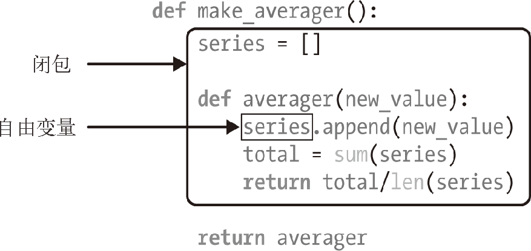

## 前言

闭包是基础中的基础，除了在装饰器中有用处之外，闭包还是回调式异步编程和函数式编程风格的基础。

## 初识装饰器

* 装饰器是可调用的对象，其参数是另一个函数（被装饰的函数）。装饰器可能会处理被装饰的函数，然后把它返回，或者将其替换成另一个函数或可调用对象。严格来说，装饰器只是语法糖。装饰器可以像常规的可调用对象那样调用，其参数是另一个函数。

* 装饰器有两大特性： 
    * 能把被装饰的函数替换成其他函数。
    * 装饰器在加载模块时立即执行。
    
* 何时执行装饰器：装饰器的一个关键特性是，它们在被装饰的函数定义之后立即运行。这通常是在导入时即Python 加载模块时。函数装饰器在导入模块时立即执行，而被装饰的函数只在明确调用时运行。

## 变量作用域规则

Python 不要求声明变量，但是假定在函数定义体中赋值的变量是局部变量，
但是如果忘记把变量声明为局部变量（使用 var ），可能会在不知情的情况下获取全局变量。
如果在函数中赋值时想让解释器把 b 当成全局变量，要使用 global 声明。

## 闭包

闭包指延伸了作用域的函数，其中包含函数定义体中引用、但是不在定义体中定义的非全局变量，其关键是它能访问定义体之外定义的非全局变量。

* 完整定义：在计算机科学中，闭包（Closure）是词法闭包（Lexical Closure）的简称，是引用了自由变量的函数。这个被引用的自由变量将和这个函数一同存在，即使已经离开了创造它的环境也不例外。所以，有另一种说法认为闭包是由函数和与其相关的引用环境组合而成的实体。



```
Note:闭包是一种函数，它会保留定义函数时存在的自由变量的绑定。
```

 Python 在 __code__ 属性（表示编译后的函数定义体）中保存局部变量和自由变量的名称,__closure__ 中的各个元素对应于 __code__.co_freevars 中的一个名称。这些元素是 cell 对象，有个 cell_contents 属性，保存着真正的值
 
 
* nonlocal:Python 3 引入了 nonlocal 声明。它的作用是把变量标记为自由变量，即使在函数中为变量赋予新值了，也会变成自由变量。如果为 nonlocal 声明的变量赋予新值，闭包中保存的绑定会更新。

```
Note:对数字、字符串、元组等不可变类型来说，只能读取，不能更新。如果尝试重新绑定，
     例如count=count+1，其实会隐式创建局部变量count。这样，count就不是自由变量了，因此不会保存在闭包中。

总结:
如果在内部函数中只是仅仅读外部变量，可以不在此变量前加nonlocal
如果在内部函数中尝试进行修改外部变量，且外部变量为不可变类型，则需要在变量前加nonlocal，
如果变量为可变类型，则不需要添加nonlocal
```

## 深入装饰器

* @wraps:很多时候也会使用functools的wraps来创建装饰器，这是为了被封装的函数能保留原来的内置属性。

```
from functools import wraps
def test1(value):
    def _test1(func):
        @wraps(func)
        def wrapped_function():
            print("before")
            print(value)
            func()
            print("after")
         return wrapped_function
    return _test1
@test1(value=2)
def test2():
    print("sssss")
```

* 叠放装饰器：把 @d1 和 @d2 两个装饰器按顺序应用到 f 函数上，作用相当于 f = d1(d2(f)) 

* 参数化装饰器：参数化装饰器通常会把被装饰的函数替换掉，而且结构上需要多一层嵌套。