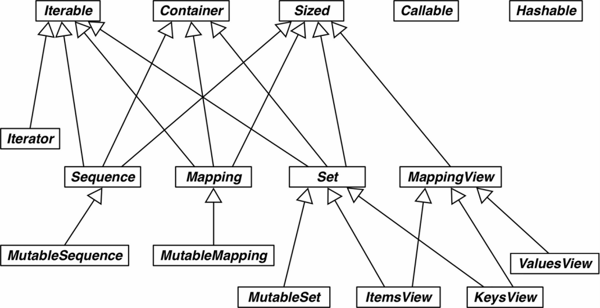

## 从鸭子类型到抽象基类

从鸭子类型的代表特征动态协议，到使接口更明确、能验证实现是否符合规定的抽象基类（Abstract Base Class，ABC）。

* Python文化中的接口和协议：Python语言没有 interface 关键字，而且除了抽象基类，每个类都有接口：类实现或继承的公开属性（方法或数据属性），包括特殊方法，如__getitem__ 或 __add__。协议是接口，但不是正式的（只由文档和约定定义），因此协议不能像正式接口那样施加限制（后面会说明抽象基类对接口一致性的强制）。一个类可能只实现部分接口，这是允许的。

* 猴子补丁：在运行时修改类或模块，而不改动源码

    ``` 
    def set_card(deck, position, card):
        deck._cards[position] = card
    猴子补丁，把自定义的函数赋值给__setitem__，把它变成可变的。
    FrenchDeck.__setitem__ = set_card
    ``` 

    
* 继承抽象基类：要想实现子类，我们可以覆盖从抽象基类中继承的方法，以更高效的方式重新实现。

* abc模块：默认情况下，Python解析器不强制检查对抽象类的继承，即抽象类的子类可能没有实现其中的抽象方法，但是Python并不会报错。为了避免这种情况，从Python 3.4/2.6开始，Python标准库中提供了abc模块（Abstract Base Classes），为定义Python的抽象基类提供了公共基础。



* 抽象基类实现的步骤
    1.导入abc模块的抽象基类ABC和方法abstractmethod:
    2.定义抽象基类:抽象基类要求从ABC类或其子类派生:
    3.使用abstractmethod装饰器定义抽象方法或抽象属性，类似于类方法定义
    抽象方法是子类必须实现的方法，否则子类无法定义。
    ``` 
        from abc import  ABC, abstractmethod
        class 抽象基类名(ABC):
                  类体代码
        @abstractmethod
        def 抽象方法名(self):                
    ``` 
    其实，抽象方法可以有实现代码。即便实现了，子类也必须覆盖抽象方法，但是在子类中可以使用 super() 函数调用抽象方法，为它添加功能，而不是从头开始实现。
    ``` 
    super() 函数是用于调用父类(超类)的一个方法。
    Python3.x 和 Python2.x 的一个区别是: Python 3 可以使用直接使用 super().xxx 代替 super(Class, self).xxx :
    __subclasses__() 这个方法返回类的直接子类列表，不含虚拟子类。
    ``` 