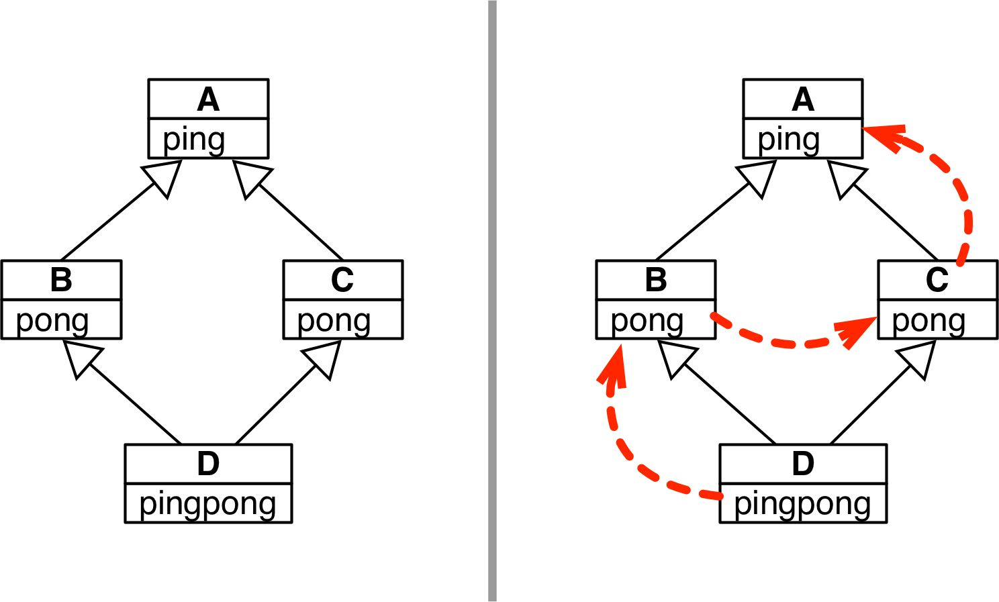
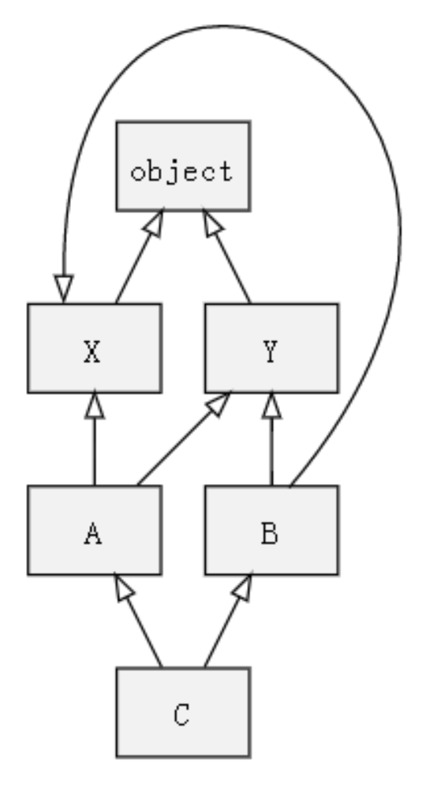

## 继承相关

Python支持多重继承

* 多重继承和方法解析顺序，如果同级别的超类定义了同名属性，Python 需要确定使用哪个。

* 任何实现多重继承的语言都要处理潜在的命名冲突，这种冲突由不相关的祖先类实现同名方法引起,这种冲突称为“菱形问题”.



* MRO大法：对于支持继承的编程语言来说，其方法（属性）可能定义在当前类，也可能来自于基类，所以在方法调用时就需要对当前类和基类进行搜索以确定方法所在的位置。而搜索的顺序就是所谓的方法解析顺序【Method Resolution Order】即MRO。MRO 是把类的继承关系线性化的一个过程，而线性化方式决定了程序运行过程中具体会调用哪个方法。类都有一个名为__mro__ 的属性，它的值是一个元组，按照方法解析顺序列出各个超类。
    ```
    内置的 super() 函数会按照 __mro__ 属性给出的顺序调用超类的方法。
    ```

## 经典类和新式类

* Python 有两种类：经典类（classic class）和新式类（new-style class）。两者的不同之处在于新式类继承自 object。在 Python 2.1 以前，经典类是唯一可用的形式；Python 2.2 引入了新式类，使得类和内置类型更加统一；在 Python 3 中，新式类是唯一支持的类。

## 多种MRO

* 经典类的MRO：经典类采用了一种很简单的 MRO 方法：从左至右的深度优先遍历。以上述「菱形继承」为例，其查找顺序为 [D, B, A, C, A]，如果只保留重复类的第一个则结果为 [D,B,A,C]。这种深度优先遍历对于简单的情况还能处理的不错
    * 对于上述「菱形继承」其结果却不尽如人意，虽然 C.show() 是 A.show() 的更具体化版本，但我们的x.show() 没有调用它，而是调用了 A.show()，这显然不是我们希望的结果，因此这种MRO方式被废除了。
    
* Python 2.2中的新式类MRO：对于新式类，所有类都要继承obejct，需要在创建类时继承object，同时可以使用__mro__查看MRO，对于新式类的MRO，将是自左向右的广度遍历，但是对于复杂的情况还会产生问题。



首先进行深度遍历，结果为 [C, A, X, object, Y, object, B, Y, object, X, object]；然后，只保留重复元素的最后一个，结果为 [C, A, B, Y, X, object]。
对于 A 来说，其搜索顺序为[A, X, Y, object]；对于 B，其搜索顺序为 [B, Y, X, object]；对于 C，其搜索顺序为[C, A, B, X, Y, object]。我们会发现，B 和 C 中 X、Y 的搜索顺序是相反的！
   
    
    ```
        上述继承关系违反了线性化的单调性原则
        子类不能改变基类的方法搜索顺序。在 Python 2.2 的 MRO 算法中并不能保证这种单调性 
    ```

* C3 MRO:在Python 2.3及其以后的版本中，新式类的MRO使用C3算法，并且在Python 3中只存在新式类。Python 2.3及其以后的新式类MRO，使用的是拓扑排序，在一个有向无环图中：
    * 选择一个入度为0的顶点并输出（入度：以某顶点为弧头，终止于该顶点的弧的数目）
    * 从网中删除此顶点以及所有出边
    * 重复步骤1、2，直到所有点都被遍历    
    
## 相关链接

https://www.cnblogs.com/gandoufu/p/9634914.html