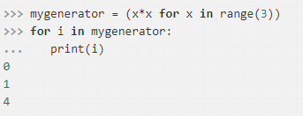

## 迭代器和生成器

* 迭代器模式：迭代是数据处理的基石。扫描内存中放不下的数据集时，我们要找到一种惰性获取数据项的方式，即按需一次获取一个数据项，这就是迭代器模式（Iterator pattern）。所有生成器都是迭代器，因为生成器完全实现了迭代器接口。

* 生成器：生成器有广泛的用途，即使是内置的 range() 函数也返回一个类似生成器的对象，而以前则返回完整的列表。

## 迭代器

* 序列可以迭代的原因iter函数，解释器需要迭代对象x时会自动调用iter(x)，内置的 iter 函数有以下作用。

    * 检查对象是否实现了 __iter__ 方法，如果实现了就调用它，获取一个迭代器。

    * 如果没有实现 __iter__ 方法，但是实现了 __getitem__ 方法，Python 会创建一个迭代器，尝试按顺序（从索引 0 开始）获取元素。

    * 如果尝试失败，Python 抛出 TypeError 异常，通常会提示“C object is not iterable”（C 对象不可迭代），其中 C 是目标对象所属的类。
    
  ```     
    任何 Python 序列都可迭代的原因是，它们都实现了 __getitem__ 方法。其实，标准的序列也都实现了 __iter__ 方法，因此你也应该这么做。之所以对 __getitem__ 方法做特殊处理，是为了向后兼容。
  ``` 
  
## 可迭代的对象与迭代器的对比

* 可迭代的对象：使用 iter 内置函数可以获取迭代器的对象。如果对象实现了能返回迭代器 的 __iter__ 方法，那么对象就是可迭代的。序列都可以迭代；实现了 __getitem__ 方法，而且其参数是从零开始的索引，这种对象也可以迭代。Python 从可迭代的对象中获取迭代器。

* 迭代的背后：
``` 
   it = iter(s)  # 获取迭代器
   while True:
     try:
        print(next(it))  # 不断在迭代器上调用 next 函数
     except StopIteration:  # 迭代器会抛出 StopIteration 异常，StopIteration 异常表明迭代器到头了。
        del it  # 废弃迭代器对象
        break   # 跳过迭代循环
``` 

* 迭代器的接口：
``` 
    __next__：返回下一个可用的元素，如果没有元素了，抛出 StopIteration 异常。
    __iter__：返回 self ，以便在应该使用可迭代对象的地方使用迭代器
    在 Python 3 中，Iterator 抽象基类定义的抽象方法是 it.__next__() ，而在 Python 2 中是 it.next()。
    一如既往，我们应该避免直接调用特殊方法，使用 next(it) 即可，这个内置的函数在 Python 2 和 Python 3 中都能使用。
``` 


* 坏主意把可迭代对象变成迭代器：迭代器可以迭代，但是可迭代的对象不是迭代器，实现上述是反模式的做法。迭代器模式可用来：访问一个聚合对象的内容而无需暴露它的内部表示,支持对聚合对象的多种遍历,为遍历不同的聚合结构提供一个统一的接口（即支持多态迭代），为了支持多种遍历，必须能从同一个可迭代的实例中获取多个独立的迭代器。

## 生成器函数

* 定义：生成器也是可迭代对象，生成器都是迭代器对象，因此可以使用生成器来替代自己实现迭代器,生成器是一个函数，它用于生成值的序列
生成器是一种只能迭代一次的迭代器，生成器不会一次将所有的元素存入内存中，而是一边迭代一边运算.

* 生成器实现方式：列表生成式的[]改成()，使用yield关键字。

    * 只要 Python 函数的定义体中有 yield 关键字，该函数就是生成器函数。调用生成器函数时，会返回一个生成器对象。也就是说生成器函数是生成器工厂。
    
    * 把生成器传给 next(...) 函数时，生成器函数会向前，执行函数定义体中的下一个 yield 语句，返回产出的值，并在函数定义体的当前位置暂停。最终，函数的定义体返回时，外层的生成器对象会抛出 StopIteration 异常——这一点与迭代器协议一致。
    
* 生成器总结：生成器是这样的一种函数，它记住上一次返回（调用）时所在函数体中的位置，而上次调用时的所有局部变量都保持不变。生成器不仅记住了它的数据状态，还记住了它在流控制构造（在命令式编程中，这种构造不只是数据值）中的位置。生成器的特点：节约内存，迭代下一次调用时，函数内部所使用的参数都是从第一次调用时就开始保留下来的，而不是新创建的。

* 生成器表达式：[]换成()



## 进阶

* Python 3.4 中的 itertools 模块提供了 19 个生成器函数，结合起来使用能实现很多有趣的用法。

``` 
生成等差序列
>>> import itertools
>>> gen = itertools.count(1, .5)
``` 

## yield from

* yield from 是 python3.3以后出现的最新句法，yield from 后面需要加的是可迭代对象，它可以是普通的可迭代对象，也可以是迭代器，甚至是生成器。当 yield from 后面加上一个生成器后，就实现了生成的嵌套。当然实现生成器的嵌套，并不是一定必须要使用yield from，而是使用yield from可以让我们避免让我们自己处理各种料想不到的异常，而让我们专注于业务代码的实现。

## 从生成器到协程

* Python 2.5 实现了“PEP 342 — Coroutines via Enhanced Generators”（https://www.python.org/dev/peps/pep-0342/ ）。这个提案为生成器对象添加了额外的方法和功能，其中最值得关注的是 .send() 方法。

* 与 .__next__() 方法一样，.send() 方法致使生成器前进到下一个 yield 语句。不过，.send() 方法还允许使用生成器的客户把数据发给自己，即不管传给 .send() 方法什么参数，那个参数都会成为生成器函数定义体中对应的 yield 表达式的值，.send() 方法允许在客户代码和生成器之间双向交换数据。而 .__next__() 方法只允许客户从生成器中获取数据。


## 相关链接

https://www.cnblogs.com/wongbingming/p/9085268.html