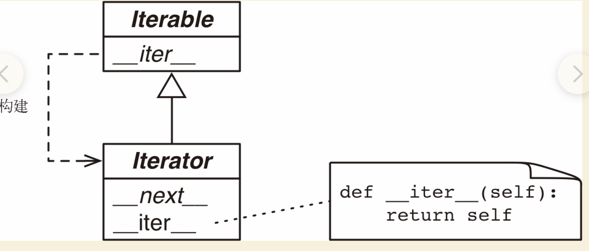

## 迭代器和生成器

* 迭代器模式：迭代是数据处理的基石。扫描内存中放不下的数据集时，我们要找到一种惰性获取数据项的方式，即按需一次获取一个数据项，这就是迭代器模式（Iterator pattern）。所有生成器都是迭代器，因为生成器完全实现了迭代器接口。

* 生成器：生成器有广泛的用途，即使是内置的 range() 函数也返回一个类似生成器的对象，而以前则返回完整的列表。

## 迭代器

* 序列可以迭代的原因iter函数，解释器需要迭代对象x时会自动调用iter(x)，内置的 iter 函数有以下作用。

    * 检查对象是否实现了 __iter__ 方法，如果实现了就调用它，获取一个迭代器。

    * 如果没有实现 __iter__ 方法，但是实现了 __getitem__ 方法，Python 会创建一个迭代器，尝试按顺序（从索引 0 开始）获取元素。

    * 如果尝试失败，Python 抛出 TypeError 异常，通常会提示“C object is not iterable”（C 对象不可迭代），其中 C 是目标对象所属的类。
    
  ```     
    任何 Python 序列都可迭代的原因是，它们都实现了 __getitem__ 方法。其实，标准的序列也都实现了 __iter__ 方法，因此你也应该这么做。之所以对 __getitem__ 方法做特殊处理，是为了向后兼容。
  ``` 
  
## 可迭代的对象与迭代器的对比

* 可迭代的对象：使用 iter 内置函数可以获取迭代器的对象。如果对象实现了能返回迭代器 的 __iter__ 方法，那么对象就是可迭代的。序列都可以迭代；实现了 __getitem__ 方法，而且其参数是从零开始的索引，这种对象也可以迭代。Python 从可迭代的对象中获取迭代器。

* 迭代的背后：
``` 
   it = iter(s)  # 获取迭代器
   while True:
     try:
        print(next(it))  # 不断在迭代器上调用 next 函数
     except StopIteration:  # 迭代器会抛出 StopIteration 异常，StopIteration 异常表明迭代器到头了。
        del it  # 废弃迭代器对象
        break   # 跳过迭代循环
``` 

* 迭代器的接口：
``` 
    __next__：返回下一个可用的元素，如果没有元素了，抛出 StopIteration 异常。
    __iter__：返回 self ，以便在应该使用可迭代对象的地方使用迭代器
    在 Python 3 中，Iterator 抽象基类定义的抽象方法是 it.__next__() ，而在 Python 2 中是 it.next()。
    一如既往，我们应该避免直接调用特殊方法，使用 next(it) 即可，这个内置的函数在 Python 2 和 Python 3 中都能使用。
``` 



* 坏主意把可迭代对象变成迭代器：迭代器可以迭代，但是可迭代的对象不是迭代器，实现上述是反模式的做法。迭代器模式可用来：访问一个聚合对象的内容而无需暴露它的内部表示,支持对聚合对象的多种遍历,为遍历不同的聚合结构提供一个统一的接口（即支持多态迭代），为了支持多种遍历，必须能从同一个可迭代的实例中获取多个独立的迭代器。
