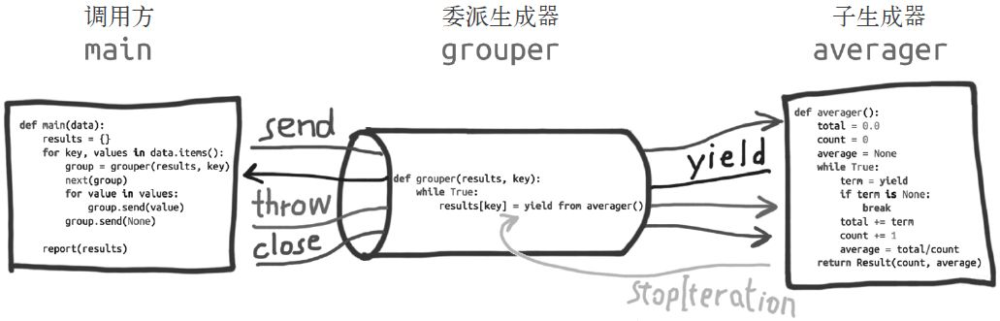

## 再谈yield

* yield之于生成器

字典为动词“to yield”给出了两个释义：产出和让步。对于 Python 生成器中的 yield 来说，这两个含义都成立。yield item 这行代码会产出一个值，提供给 next的调用方；此外，还会作出让步，暂停执行生成器，让调用方继续工作，直到需要使用另一个值时再调用next。调用方会从生成器中拉取值。

* yield之于协程

协程可能会从调用方接收数据，不过调用方把数据提供给协程使用的是 .send(datum) 方法，而不是 next函数。通常，调用方会把值推送给协程。在协程中，yield 通常出现在表达式的右边（例如，datum = yield ），可以产出值，也可以不产出——如果 yield 关键字后面没有表达式，那么生成器产出 None 。

 ``` 
把 yield 视作控制流程的方式，使用它可以实现协作式多任务：协程可以把控制器让步给中心调度程序，从而激活其他的协程。
 ```
 
## 生成器进化到协程

* 协程的底层架构在“PEP 342—Coroutines via Enhanced Generators”（https://www.python.org/dev/peps/pep-0342/ ）中定义，并在 Python 2.5（2006 年）实现了。自此之后，yield 关键字可以在表达式中使用，而且生成器 API 中增加了 .send(value) 方法。生成器的调用方可以使用 .send(...) 方法发送数据，发送的数据会成为生成器函数中 yield 表达式的值。因此，生成器可以作为协程使用。除了 .send(...) 方法，PEP 342 还添加了 .throw(...) 和 .close() 方法：前者的作用是让调用方抛出异常，在生成器中处理；后者的作用是终止生成器。

* 协程最近的演进来自 Python 3.3（2012 年）实现的“PEP 380—Syntax for Delegating to a Subgenerator”（https://www.python.org/dev/peps/pep-0380/ ）。PEP 380 对生成器函数的句法做了两处改动，以便更好地作为协程使用。新引入了 yield from 句法，使用它可以把复杂的生成器重构成小型的嵌套生成器，省去了之前把生成器的工作委托给子生成器所需的大量样板代码。

     ``` 
    首先要调用 next(...) 函数，因为生成器还没启动，没在 yield 语句处暂停，所以一开始无法发送数据。
     ``` 
     
* 协程可以身处四个状态中的一个。当前状态可以使用 inspect.getgeneratorstate(...) 函数确定，该函数会返回下述字符串中的一个。

    * GEN_CREATED：等待开始执行。

    * GEN_RUNNING：解释器正在执行。只有在多线程应用中才能看到这个状态。此外，生成器对象在自己身上调用 getgeneratorstate 函数也行，不过这样做没什么用。

    * GEN_SUSPENDED：在 yield 表达式处暂停。

    * GEN_CLOSED：执行结束。
    
    因为 send 方法的参数会成为暂停的 yield 表达式的值，所以，仅当协程处于暂停状态时才能调用 send 方法，因此需要调用 next(my_coro) 激活协程使其离开CREATED状态。
    ``` 
    最先调用 next(my_coro) 函数这一步通常称为“预激”（prime）协程（即，让协程向前执行到第一个 yield 表达式，准备好作为活跃的协程使用）。
    ``` 
    
* 从 Python 2.5 开始，客户代码可以在生成器对象上调用两个方法，显式地把异常发给协程。这两个方法是 throw 和 close 。
    
    * generator.throw(exc_type[, exc_value[, traceback]])：致使生成器在暂停的 yield 表达式处抛出指定的异常。如果生成器处理了抛出的异常，代码会向前执行到下一个 yield 表达式，而产出的值会成为调用 generator.throw 方法得到的返回值。如果生成器没有处理抛出的异常，异常会向上冒泡，传到调用方的上下文中。如果传入协程的异常没有处理，协程会停止，即状态变成 'GEN_CLOSED'
    
    * generator.close()：致使生成器在暂停的 yield 表达式处抛出 GeneratorExit 异常。如果生成器没有处理这个异常，或者抛出了 StopIteration 异常（通常是指运行到结尾），调用方不会报错。
    
    ```
        需要注意的是，GeneratorExit异常的产生意味着生成器对象的生命周期已经结束。
        因此，一旦产生了GeneratorExit异常，生成器方法后续执行的语句中，不能再有yield语句【抛出这个异常，协程就结束了】，否则会产生RuntimeError。
        GeneratorExit异常定义的初衷，是方便开发者在生成器对象调用结束后定义一些收尾的工作，如释放资源等。
    ```
    * 如果不管协程如何结束都想做些清理工作，要把协程定义体中相关的代码放入 try/finally 块中。
    
## yield from

* yield from 是在Python3.3才出现的语法。所以这个特性在Python2中是没有的。yield from 后面需要加的是可迭代对象，它可以是普通的可迭代对象，也可以是迭代器，甚至是生成器，实际应用如下：
    * 拼接可迭代对象：使用yield from 替代在for循环里面yield
    * 生成器的嵌套：使用yield from可以让我们避免让我们自己处理各种料想不到的异常，而让我们专注于业务代码的实现。
 
* yield from 的主要功能是打开双向通道，把最外层的调用方与最内层的子生成器连接起来，这样二者可以直接发送和产出值，还可以直接传入异常，而不用在位于中间的协程中添加大量处理异常的样板代码。有了这个结构，协程可以通过以前不可能的方式委托职责，相关术语如下：
    *  调用方：调用委派生成器的客户端（调用方）代码
    *  委托生成器：包含yield from表达式的生成器函数
    *  子生成器：yield from后面加的生成器函数
    

        
   