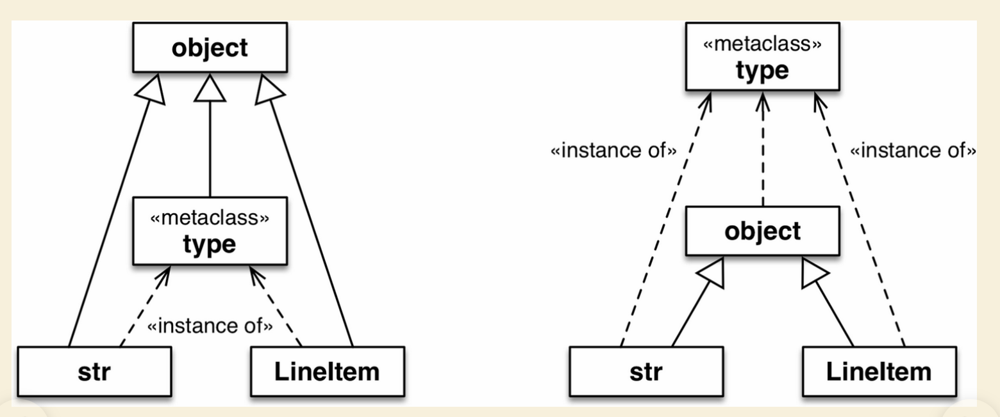

## 类元编程

类元编程是指在运行时创建或定制类的技艺。在 Python 中，类是一等对象，因此任何时候都可以使用函数新建类，而无需使用 class 关键字。元类是类元编程最高级的工具：使用元类可以创建具有某种特质的全新类种，例如我们见过的抽象基类。

* 类工厂函数：标准库中的一个类工厂函数collections.namedtuple 。我们把一个类名和几个属性名传给这个函数，它会创建一个 tuple 的子类，其中的元素通过名称获取，还为调试提供了友好的字符串表示形式（__repr__ ）。

* 神奇的type函数：type是可以实现动态创建类的，其实python中一切都是对象，类也是对象；只不过是一种特殊的对象，是type的对象。当你使用class关键字时，Python解释器自动创建这个对象。而底层其实使用的是type函数(type函数也可以查看实例所属类型)来创建类的。所以我们可以直接使用type()函数来手动实现动态创建类。
    * 当type（）只有一个参数时，其作用就是返回变量或对象的类型
    * 当type（）有三个参数时，其作用就是创建类对象：第一个参数：name表示类名称，字符串类型，第二个参数：bases表示继承对象（父类），元组类型，单元素使用逗号，第三个参数：attr表示属性，这里可以填写类属性、类方式、静态方法，采用字典格式，key为属性名，value为属性值。


## 类元基础

元类时生产类的工厂。python的类和函数都时type类的实例。也可以认为类与函数都是type创建出来的。

* 等级关系：默认情况下，Python 中的类是 type 类的实例。也就是说，type 是大多数内置的类和用户定义的类的元类，我们使用的实例是类的实例，类又是type的实例，为了避免无限回溯，type 是其自身的实例。



两个示意图都是正确的。左边的示意图强调 str 、type 和 LineItem 是 object 的子类。右边的示意图则清楚地表明 str 、object 和 LineItem 是 type 的实。

* object 类和 type 类之间的关系：object 是 type 的实例，而 type 是 object 的子类。这种关系很“神奇”，无法使用 Python 代码表述，因为定义其中一个之前另一个必须存在。type 是自身的实例这一点也很神奇。

```
>>> import collections
>>> collections.Iterable.__class__
<class 'abc.ABCMeta'>
>>> import abc
>>> abc.ABCMeta.__class__
<class 'type'>
>>> abc.ABCMeta.__mro__
(<class 'abc.ABCMeta'>, <class 'type'>, <class 'object'>)
```

Iterable 是 object 的子类，是 ABCMeta 的实例。object 和 ABCMeta 都是 type 的实例，但是这里的重要关系是，ABCMeta 还是 type 的子类，因为 ABCMeta 是元类。所有类都是 type 的实例，但是元类还是 type 的子类，因此可以作为制造类的工厂，type就是可以动态地创建类。

* 知识点
    * 元类的实例是类
    * 元类的子类还是元类
    * 元类可以当做类装饰器来使用
    * 除了使用元类的构造方法直接构造类对象以外、还可以使用如下方法声明某类是某元类的实例
    * 元类的实例的子类也是该元类的实例

```
class A(metaclass = MetaAleph):
    ... 省略 ...

```

解释器在执行完 A 类的定义体以后，得到 A 类的类对象、类名、父类集合、参数字典数据，并将之传递给 MetaAleph 类的构造方法 __init__ ，真实的 A 类对象其实是经过 __init__ 修改过的类。元类和__new__不要同时使用，使用过程中实际上利用__init__ 方法定制类。

* 元类的特殊方法__perpare__

type 构造方法及元类的 __new__ 和 __init__ 方法都会收到要计算的类的定义体，形式是名称到属性的映像。然而在默认情况下，那个映射是字典；也就是说，元类或类装饰器获得映射时，属性在类定义体中的顺序已经丢失了。
这个问题的解决办法是，使用 Python 3 引入的特殊方法 __prepare__ 。这个特殊方法只在元类中有用，而且必须声明为类方法（即，要使用 @classmethod 装饰器定义）。解释器调用元类的 __new__ 方法之前会先调用 __prepare__ 方法，使用类定义体中的属性创建映射。__prepare__ 方法的第一个参数是元类，随后两个参数分别是要构建的类的名称和基类组成的元组，返回值必须是映射。元类构建新类时，__prepare__ 方法返回的映射会传给 __new__ 方法的最后一个参数，然后再传给 __init__ 方法。


## 类作为对象

cls.__bases__ 由类的基类组成的元组。
cls.__qualname__ Python 3.3 新引入的属性，其值是类或函数的限定名称.
cls.__subclasses__() 这个方法返回一个列表，包含类的直接子类。
cls.mro() 构建类时，如果需要获取储存在类属性 __mro__ 中的超类元组


## 常用函数再整理

* dir() 函数，通过此函数可以某个对象拥有的所有的属性名和方法名，该函数会返回一个包含有所有属性名和方法名的有序列表。

* __dict__是dir()的子集，dir()包含__dict__中的属性,一个实例的 __dict__ 属性仅仅是那个实例的局部属性集合，不包含该实例所有有效属性。所以如果你想获取一个对象所有有效属性，你应该使用 dir() 来替代 __dict__ 或者 __slots__。