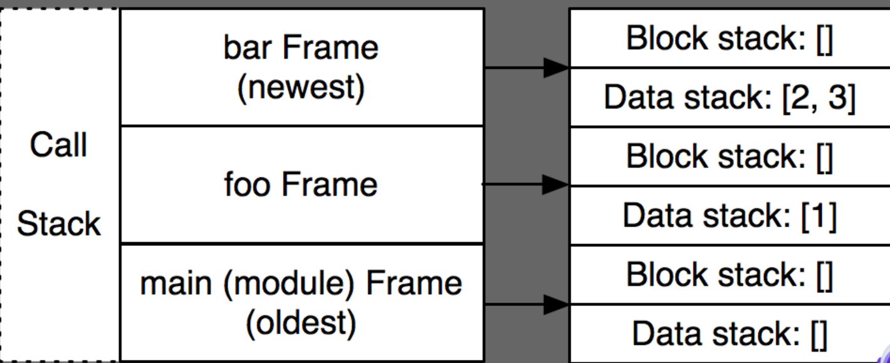

# **Python实用技巧**

唱吧-技术部-费沛轩

---
# Python 起源

Guido van Rossum（吉多·范罗苏姆）1982年获得阿姆斯特丹大学的数学和计算机科学的硕士学位。1989年，他创立了Python语言，这一名字来源于Python来自Guido所挚爱的电视剧。

---
# Python 历史变迁

1989年，被称为龟叔的Guido在为ABC语言写插件时，产生了写一个简洁又实用的编程语言的想法，并开始着手编写，python由此诞生。
1990年，发布了python的第一个版本。
2001年，发布了python 2.x版本，版本更新至2.7，2.x内不再更新2.7以上版本。
<!-- 2020年已经停止维护了-->
2013年，发布了python 3.0版本。
<!--Python2 的默认编码是 asscii，默认代码中不支持中文，字符串有两种类型-->
<!--Python3 的默认编码是 UTF-8 -->
2019年，发布了Python 3.8 版本。

---
# Python 设计之禅


---
# Pythonic

```markdown.
if a < b and a > c: # bad
   pass

if c < a < b: # good
    pass

i = 0
while i < mylist_length: # bad
    do_something(mylist[i])
    i += 1

for element in mylist: # good
    do_something(element)

```

---
# PEP8

PEP的全称是Python Enhancement Proposals，其中Enhancement是增强改进的意思，Proposals则可译为提案或建议书，所以合起来，比较常见的翻译是Python增强提案或Python改进建议书。

pep8是Style Guide for Python Code即python编码规范。

* 每一级缩进使用4个空格。
* 导入应该按照以下顺序分组：1. 标准库导入2. 相关的第三方导入 3. 特定的本地应用/库导入 在每个导入组之间放一行空行。
* 函数名应该是小写字母，必要时单词用下划线分开以提高可读性。
* 方法名和实例变量：采用函数命名规则。


--- 
# Python 运行机制

Python的运行机制主要分为四个步骤：
* 步骤1：源代码文件：就是我们写出来的程序文件，以“.py"格式存储
* 步骤2：编译：Python会对源代码进行编译
* 步骤3：编译后的结果是字节码文件：字节码文件会以”.pyc"的格式存在，Python3在 __pycache__文件夹中。
* 步骤4：Python虚拟机上运行字节码。CPython是官方版本的解释器，Jython是运行在Java平台上的Python解释器。PyPy是另一个Python解释器，它的目标是执行速度。


---
# 字节码

dis模块通过反汇编支持CPython的 bytecode 分析。
```markdown
def add(x,y):
    z = x+y
    return z
```    
```markdown
  5           0 LOAD_FAST                0 (x)
              2 LOAD_FAST                1 (y)
              4 BINARY_ADD
              6 STORE_FAST               2 (z)

  6           8 LOAD_FAST                2 (z)
             10 RETURN_VALUE
```
<!-- 基于栈的字节码虚拟机 -->

--- 

# 栈帧

帧包含了一段代码运行所需要的信息与上下文环境。帧在代码执行时被动态地创建与销毁，每一个帧的创建对应一次函数调用，帧存在于调用栈中,你在程序异常时所看到的 Traceback 就是调用栈中的信息。




---

# 栈帧
```markdown
>>> def bar(y):
...     z = y + 3         # <--- (3) ... 现在解释器执行到这里
...     return z
>>> def foo():
...     a = 1
...     b = 2
...     return a + bar(b) # <--- (2) ... 调用 bar 函数
>>> def main():
        foo()             # <--- (1)
```
RETURN时令解释器在帧之间传递一个值，首先调用栈的栈顶帧的数据栈的栈顶值会被弹出，之后丢弃栈顶帧，将之前弹出的值压到下一个帧的数据栈中。这样就完成了一次 RETURN_VALUE 。

---
# 动态语言之殇

```markdown
>>> def div(a,b):
...     return a/b

div("2",-999)
``` 
所以编译器对于我们的代码行为其实了解甚少，是解释器决定了变量的类型，换言之我们在运行时才知道数据类型，所有只有在解释执行的过程中才能发现问题，使用 C 语言等静态语言实现 Python 解释器时必须做类型判断。反之，静态类型需要程序员事先确定变量的类型，一些类型不匹配的问题在编译时就能确定。


---

# 并行和并发


* 并发是两个队列交替使用一台咖啡机，并行是两个队列同时使用两台咖啡机。
* 单核心处理器仅支持并发，多核心处理器上才支持并行。
----
# 多线程并发

CPython的线程是操作系统的原生线程。在Linux上为pthread，在Windows上为Win thread，完全由操作系统调度线程的执行。一个python解释器进程内有一条主线程，以及多条用户程序的执行线程。

Python解释器不是完全线程安全的。为了支持多线程Python程序，有一个全局锁，称为全局解释器锁或GIL，它必须由当前线程持有，然后才能安全地访问Python对象。

CPython在内存管理中采用引用计数的方式。当多个线程同时使用同一个对象时，引用计数非常容易出错,引入GIL解决了这个问题。


<!--http://www.dabeaz.com/python/GIL.pdf -->


----

# GIL


----


# GIL
python3.x中，GIL不使用ticks计数，改为使用计时器（执行时间达到阈值后，当前线程释放GIL），这样对CPU密集型程序更加友好，但依然没有解决GIL导致的同一时间只能执行一个线程的问题，所以效率依然不尽如人意。

<!-- python3会动态调整线程的优先级，解决抢占式调度的问题 -->

----

# GIL解决了线程安全？

```markdown
def test3():
    global a
    a+=1
```

```markdown
  16          0 LOAD_GLOBAL              0 (a)
              3 LOAD_CONST               1 (1)
              6 INPLACE_ADD
              7 STORE_GLOBAL             0 (a)
             10 LOAD_CONST               0 (None)
             13 RETURN_VALUE
```

----

# 多进程并行
multiprocessing 是一个支持使用与 threading 模块类似的 API 来产生进程的包。multiprocessing 包同时提供了本地和远程并发操作，通过使用子进程而非线程有效地绕过了全局解释器锁，允许程序员充分利用给定机器上的多个处理器。 它在 Unix 和 Windows 上均可运行。

```markdown
from multiprocessing import Pool
def f(x):
    return x*x
if __name__ == '__main__':
    with Pool(5) as p:
        print(p.map(f, [1, 2, 3]))
```
----

# 协程演变史


